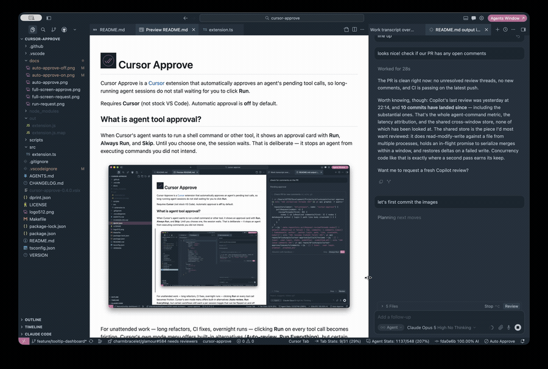
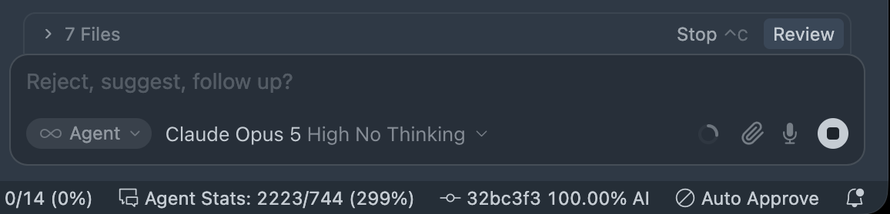
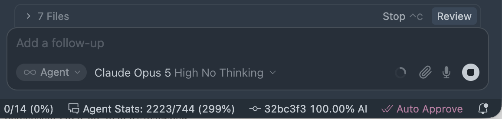
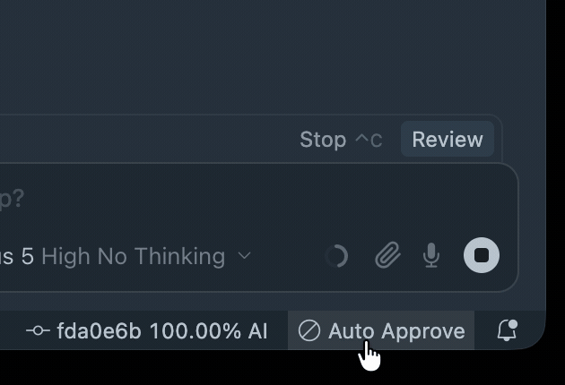

<!-- markdownlint-disable MD033 -->

#  Cursor Approve

<!-- markdownlint-enable MD033 -->

Cursor Approve is a [Cursor](https://cursor.com/) extension that automatically approves an agent's pending tool calls,
so long-running agent sessions do not stall waiting for you to click **Run**.

Requires **Cursor** (not stock VS Code). Automatic approval is **off** by default.

## What is agent tool approval?

When Cursor's agent wants to run a shell command or other tool, it shows an approval card with **Run**, **Always Run**,
and **Skip**. Until you choose one, the session waits. That is deliberate — it stops an agent from executing commands
you did not intend.



For unattended work — long refactors, CI fixes, overnight runs — clicking **Run** on every tool call becomes friction.
Cursor's own mode menu offers built-in alternatives (**Auto-review**, **Run Everything**), but certain workflows still
want a per-session toggle that can be flipped on and off without changing global agent settings.

## What is this extension?

This is a small VS Code extension that runs inside Cursor's extension host. It does not simulate keystrokes, capture the
screen, or scrape the pink **Run** button. Instead it calls Cursor's own workbench command — the same one bound to
`Enter` when a tool call is pending. That makes it independent of your theme, window position, display scaling, and
multi-monitor layout. It also cannot leak a stray `Enter` into your editor or terminal when nothing is waiting for
approval.

A status bar toggle menu shows whether automatic approval is active.

<!-- markdownlint-disable MD033 -->





<!-- markdownlint-enable MD033 -->

Hover it for a compact dashboard: the mode it is approving in and how often it polls, when it was switched on, and how
long it has been active this session and today, each beside the share of the agent's commands it approved.

The bottom row is live. **Toggle On/Off** flips approval from the hover itself, **Diagnostics** opens the full report in
the Output panel, and **Settings** jumps to this extension's settings. Clicking the status bar item, the Command
Palette, and `cursorApprove.enabled` toggle it from elsewhere.



## Quick start

Install the latest `.vsix` from [Releases](https://github.com/drluckyspin/cursor-approve/releases), then:

```bash
cursor --install-extension cursor-approve-0.4.0.vsix
```

Reload the window (`Cmd+Shift+P` → **Developer: Reload Window**), then click **Auto Approve** in the status bar or run
**Cursor Approve: Toggle Automatic Approval** from the Command Palette.

To verify the extension can hook into Cursor's commands, run **Cursor Approve: List Cursor Composer Commands** and
confirm `composer.approvePendingShellToolDecision` appears in the output.

### From source

```bash
git clone https://github.com/drluckyspin/cursor-approve.git
cd cursor-approve
make check
make install
```

## Usage

Automatic approval is off by default. Enable it when you want unattended agent sessions; disable it when you want to
review each tool call manually.

| Command                                          | What it does                                       |
| ------------------------------------------------ | -------------------------------------------------- |
| `Cursor Approve: Toggle Automatic Approval`      | Turn polling on or off                             |
| `Cursor Approve: Approve Pending Tool Call Once` | Approve once without enabling the timer            |
| `Cursor Approve: Show Diagnostics`               | Print state to the **Cursor Approve** output panel |
| `Cursor Approve: List Cursor Composer Commands`  | Dump every registered `composer.*` command         |

### Approval modes

`cursorApprove.mode` chooses which Cursor command the timer invokes. Both map to buttons on the shell-tool approval
card; neither affects other tool types (MCP, browser, etc.).

| Mode        | Command invoked                                     | Equivalent to  |
| ----------- | --------------------------------------------------- | -------------- |
| `run`       | `composer.approvePendingShellToolDecision`          | **Run**        |
| `allowlist` | `composer.approvePendingShellToolDecisionAllowlist` | **Always Run** |

**Default is `run`.** That approves the current shell command and nothing more.

`allowlist` is opt-in and behaves like clicking **Always Run** on every pending shell approval while the extension is
active. Cursor may remember those commands and stop prompting for them later — even after you turn the extension off.
That persistence is Cursor's own allowlist, not something this extension can undo. Only use it when you are comfortable
with commands being remembered project-wide.

> **Warning:** Polling in `allowlist` mode can add many entries to Cursor's shell allowlist in a single unattended
> session. A misbehaving or prompt-injected agent could get `rm`, `curl`, or other commands remembered alongside the
> ones you intended. Prefer `run` unless you explicitly want **Always Run** behavior.

## Configuration

| Setting                           | Type      | Default               | Description                                        |
| --------------------------------- | --------- | --------------------- | -------------------------------------------------- |
| `cursorApprove.enabled`           | `boolean` | `false`               | Poll and approve automatically                     |
| `cursorApprove.intervalMs`        | `number`  | `1000`                | Poll interval in milliseconds (250–30000)          |
| `cursorApprove.mode`              | `string`  | `run`                 | `run` or `allowlist`                               |
| `cursorApprove.onlyWhenFocused`   | `boolean` | `false`               | Only approve while this window has focus           |
| `cursorApprove.showStatusBarItem` | `boolean` | `true`                | Show the status bar toggle                         |
| `cursorApprove.statusBarPriority` | `number`  | `-100`                | Position; lower values sit further right           |
| `cursorApprove.statusBarStyle`    | `string`  | `foreground`          | `foreground`, `background`, or `none`              |
| `cursorApprove.activeColor`       | `string`  | `textLink.foreground` | Accent color when `statusBarStyle` is `foreground` |

Example `settings.json`:

```json
{
  "cursorApprove.enabled": true,
  "cursorApprove.intervalMs": 1000,
  "cursorApprove.mode": "run",
  "cursorApprove.onlyWhenFocused": false
}
```

## How it works

```text
Timer (every N ms)
  → extension host calls composer.approvePendingShellToolDecision
    → Cursor's handler checks for a pending tool call
      → if none: return immediately (no-op)
      → if pending: approve (same as pressing Run)
```

Cursor registers three related commands:

| Command                                             | UI equivalent  |
| --------------------------------------------------- | -------------- |
| `composer.approvePendingShellToolDecision`          | **Run**        |
| `composer.approvePendingShellToolDecisionAllowlist` | **Always Run** |
| `composer.skipPendingShellToolDecision`             | **Skip**       |

Extensions cannot read the `composerShellToolPendingKeybindingsActive` context key that gates Cursor's own `Enter`
binding, so this extension **polls** on a timer instead. Polling is safe because the handler early-returns when nothing
is pending:

```js
const g = p.getPendingUserDecisionGroup()();
const f = jAh(g);
if (!f) return; // nothing pending, no-op
```

### Status bar position

The item sits in the right-hand status bar group, ordered by `cursorApprove.statusBarPriority`. VS Code draws higher
priorities further **left**, so the default of `-100` keeps it to the right of most extensions; lower it further to push
it toward the edge. VS Code fixes an item's priority when it is created, so the extension recreates the item whenever
you change this setting.

### Status bar highlight

The status bar item is highlighted while automatic approval is active so an unattended session never approves silently.

| Style        | Appearance                                                        |
| ------------ | ----------------------------------------------------------------- |
| `foreground` | Tints text and icon with `activeColor` (follows the theme accent) |
| `background` | Fills the item using the theme's status bar warning color         |
| `none`       | No highlight beyond the icon change                               |

`foreground` is the default because it is the only style that tracks the theme's accent color across themes. VS Code
allowlists exactly two status bar backgrounds (`statusBarItem.errorBackground` and `statusBarItem.warningBackground`),
and color customizations require literal hex values, so an extension cannot paint an arbitrary accent as a background on
its own.

If you prefer a filled item, set `statusBarStyle` to `background` and override the warning color for your theme:

```json
"workbench.colorCustomizations": {
  "[Your Theme]": {
    "statusBarItem.warningBackground": "#bd7ba2",
    "statusBarItem.warningForeground": "#ffffff"
  }
}
```

### Status dashboard

Hover **Auto Approve** for a compact, theme-native dashboard. Its counts rise as the agent works:


The dashboard reports how long automatic approval has been active, because that is how long Cursor's confirmation step
has been bypassed, and how many commands ran while it was. **Total Today** covers the current local calendar day across
every open Cursor window and survives a reload; **Current Session** counts only this window, since its extension host
activated; **Active since** is the start of the current uninterrupted stretch.

Every window runs its own copy of the extension, so the day's totals live in a file in the extension's global storage
that each window re-reads and merges into rather than overwrites. Counts add up across windows, while active time is
folded once by whichever window checkpoints next: approval is a global setting, so two windows armed for an hour is one
hour of exposure, not two.

Active time accrues as it passes rather than from a single start timestamp, so time the machine spent suspended is not
counted. A laptop left closed overnight with the toggle on does not come back reporting eight active hours.

`5/12 Auto Approved` reads as five of the twelve agent commands that ran were released by this extension. The total is
what Cursor's agent terminals report, identified the same way Cursor identifies them internally, by an `Agent Terminal`
or `Cursor (` name prefix. The gap between the two numbers is the interesting part: it is the work Cursor auto-ran on
its own, because anything covered by its allowlist or sandbox never needs an approval at all.

The approved figure is attributed by timing. Cursor's approval command reports nothing, so there is no direct signal,
but the two cases separate cleanly in practice: a command waiting on approval starts within about 50ms of the invocation
that released it, while one Cursor auto-ran starts at an arbitrary point in the poll cycle. Commands that start
immediately after an invocation are therefore counted as approved.

Anything that is only interesting when it is true gets a line only while it applies: an unavailable Cursor approval
command, unsuccessful attempts today, approval restricted to the focused window, or `allowlist` mode adding approved
commands to the allowlist. The first, second, and fourth carry a colored pill drawn from the status bar's own error and
warning colors, so they stay legible in any theme. **Show Diagnostics** remains the full, copyable breakdown.

Durations are shown in whole elapsed minutes, and the dashboard is replaced only when its rendered text changes. It is
therefore current whenever you hover it without redrawing an open hover every second. It uses the active theme's tooltip
colors, because VS Code does not give extensions an API for a custom tooltip background. Its links are restricted to
this extension's toggle and diagnostics commands plus the built-in Settings command.

An open hover keeps whatever it was rendered with, and no API can re-render or dismiss it, so **Toggle On/Off** is
worded for either state rather than claiming to turn approval off while it is already off. The values above it are
likewise from the moment the hover opened; move away and hover again for the current ones.

## Built-in alternative

Cursor ships its own tool approval modes in the agent panel's mode menu:

| Mode           | Behavior                                                                |
| -------------- | ----------------------------------------------------------------------- |
| Ask Every Time | Prompt for every tool call (default)                                    |
| Allowlist      | Auto-run allowlisted commands only                                      |
| Auto-review    | Auto-run operations Cursor classifies as safe, sandboxed where possible |
| Run Everything | Auto-approve all operations without asking                              |

If **Auto-review** or **Run Everything** fits your workflow, prefer those — they do not depend on undocumented commands
and do not require an extension. Note that switching away from **Ask Every Time** removes that option from the menu
permanently.

This extension is for users who want a **per-session toggle** without changing global agent mode, or who want **Run**
behavior (approve once) rather than **Always Run**.

## Safety

This bypasses a deliberate confirmation step. An agent that has been prompt-injected, or that simply misunderstands a
task, can run shell commands without asking while automatic approval is enabled.

- Keep the status bar toggle visible so you always know when it is active.
- Hover the status bar toggle for its configuration plus how long approval has been active this session and today.
- Use `onlyWhenFocused` if you only want unattended approval in the active window.
- Prefer `run` over `allowlist` — see [Approval modes](#approval-modes) for how **Always Run** persistence works.
- The extension disables itself after three consecutive unsuccessful approval attempts rather than looping silently.

Cursor's internal commands are undocumented and may be renamed between releases. Run **List Cursor Composer Commands**
after upgrading Cursor to confirm the approval commands still exist.

## Project layout

```text
cursor-approve/
├── src/
│   └── extension.ts          # Polling, commands, status bar, diagnostics
├── scripts/
│   ├── bump-version.sh       # Sync VERSION into package.json and README
│   └── log.bash              # Shared colored script logging
├── .github/workflows/
│   └── ci.yml                # Type check, compile, package, upload .vsix
├── .vscode/
│   ├── launch.json           # F5 → Extension Development Host
│   └── tasks.json            # npm compile / watch
├── AGENTS.md                 # Guidance for coding agents
├── dprint.json               # Markdown and TypeScript formatting
├── Makefile                  # Development and release commands
├── package.json              # Extension manifest and settings schema
├── tsconfig.json
├── VERSION                   # Semantic-version source of truth
├── CHANGELOG.md
└── LICENSE
```

## Development

Run the following from the repository root:

```bash
make check
make build      # install npm dependencies, then compile
make lint
make fmt
make package    # build cursor-approve-0.4.0.vsix
make install    # package and install the VSIX into Cursor
```

Open the folder in Cursor and press `F5` to launch an Extension Development Host with the extension loaded. Test
commands in that second window, then use **Developer: Reload Window** there after source changes.

Run `make bump-version X.Y.Z` to update `VERSION`, synchronize the extension manifest and `.vsix` install example.

## Release history

| Extension | Notes                                                                            |
| --------- | -------------------------------------------------------------------------------- |
| 0.3.2     | Diagnostics now reliably select the Cursor Approve Output channel, and the statu |
| 0.3.1     | Extension icon (`logo512.png`) in the marketplace manifest and README header.    |
| 0.3.0     | Hardening, development tooling, diagnostics, and refreshed docs                  |
| 0.2.0     | Theme-accent status bar, `statusBarStyle` setting                                |
| 0.1.0     | Initial release — polling, toggle, diagnostics                                   |

See [CHANGELOG.md](CHANGELOG.md) for the full version history. Published GitHub releases (not every table row has a
separate release): [v0.3.2](https://github.com/drluckyspin/cursor-approve/releases/tag/v0.3.2),
[v0.3.1](https://github.com/drluckyspin/cursor-approve/releases/tag/v0.3.1),
[v0.1.0](https://github.com/drluckyspin/cursor-approve/releases/tag/v0.1.0) and
[v0.3.0](https://github.com/drluckyspin/cursor-approve/releases/tag/v0.3.0).

## License

MIT — see [LICENSE](LICENSE).
