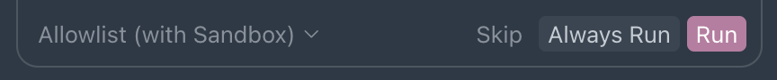

# Cursor Approve

A [Cursor](https://cursor.com/) extension that automatically approves the agent's pending tool calls, so long-running
agent sessions do not stall waiting for you to click **Run**.

Requires **Cursor** (not stock VS Code). Automatic approval is **off** by default.

## What is agent tool approval?

When Cursor's agent wants to run a shell command or other tool, it shows an approval card with **Run**, **Always Run**,
and **Skip**. Until you choose one, the session waits. That is deliberate — it stops an agent from executing commands
you did not intend.



For unattended work — long refactors, CI fixes, overnight runs — clicking **Run** on every tool call becomes friction.
Cursor's own mode menu offers built-in alternatives (**Auto-review**, **Run Everything**), but some workflows still want
a per-session toggle that can be flipped on and off without changing global agent settings.

## What is this extension?

This is a small VS Code extension that runs inside Cursor's extension host. It does not simulate keystrokes, capture the
screen, or scrape the pink **Run** button. Instead it calls Cursor's own workbench command — the same one bound to
`Enter` when a tool call is pending.

That makes it independent of your theme, window position, display scaling, and multi-monitor layout. It also cannot leak
a stray `Enter` into your editor or terminal when nothing is waiting for approval.

A status bar toggle shows whether automatic approval is armed. Click it, use the Command Palette, or flip
`cursorApprove.enabled` in settings.


## How it works

```text
Timer (every N ms)
  → extension host calls composer.approvePendingShellToolDecision
    → Cursor's handler checks for a pending tool call
      → if none: return immediately (no-op)
      → if pending: approve (same as pressing Run)
```

Cursor registers three related commands:

| Command                                             | UI equivalent  |
| --------------------------------------------------- | -------------- |
| `composer.approvePendingShellToolDecision`          | **Run**        |
| `composer.approvePendingShellToolDecisionAllowlist` | **Always Run** |
| `composer.skipPendingShellToolDecision`             | **Skip**       |

Extensions cannot read the `composerShellToolPendingKeybindingsActive` context key that gates Cursor's own `Enter`
binding, so this extension **polls** on a timer instead. Polling is safe because the handler early-returns when nothing
is pending:

```js
const g = p.getPendingUserDecisionGroup()();
const f = jAh(g);
if (!f) return; // nothing pending, no-op
```

Most ticks are genuine no-ops with no side effects.

## Quick start

Install the latest `.vsix` from [Releases](https://github.com/drluckyspin/cursor-approve/releases), then:

```bash
cursor --install-extension cursor-approve-0.2.0.vsix
```

Reload the window (`Cmd+Shift+P` → **Developer: Reload Window**), then click **Auto Approve** in the status bar or run
**Cursor Approve: Toggle Automatic Approval** from the Command Palette.

To verify the extension can reach Cursor's commands, run **Cursor Approve: List Cursor Composer Commands** and confirm
`composer.approvePendingShellToolDecision` appears in the output.

### From source

```bash
git clone https://github.com/drluckyspin/cursor-approve.git
cd cursor-approve
npm install
npm run package
cursor --install-extension cursor-approve-0.2.0.vsix
```

## Usage

Automatic approval is off by default. Enable it when you want unattended agent sessions; disable it when you want to
review each tool call manually.

| Command                                          | What it does                                       |
| ------------------------------------------------ | -------------------------------------------------- |
| `Cursor Approve: Toggle Automatic Approval`      | Turn polling on or off                             |
| `Cursor Approve: Approve Pending Tool Call Once` | Approve once without enabling the timer            |
| `Cursor Approve: Show Diagnostics`               | Print state to the **Cursor Approve** output panel |
| `Cursor Approve: List Cursor Composer Commands`  | Dump every registered `composer.*` command         |

### Approval modes

`cursorApprove.mode` chooses which command the timer invokes:

| Mode        | Command invoked                                     | Behaviour                        |
| ----------- | --------------------------------------------------- | -------------------------------- |
| `run`       | `composer.approvePendingShellToolDecision`          | Approve this call only           |
| `allowlist` | `composer.approvePendingShellToolDecisionAllowlist` | Approve and remember the command |

Default is `run`. Use `allowlist` only when you trust the commands being auto-approved.

## Configuration

| Setting                           | Type      | Default               | Description                                         |
| --------------------------------- | --------- | --------------------- | --------------------------------------------------- |
| `cursorApprove.enabled`           | `boolean` | `false`               | Poll and approve automatically                      |
| `cursorApprove.intervalMs`        | `number`  | `1000`                | Poll interval in milliseconds (250–30000)           |
| `cursorApprove.mode`              | `string`  | `run`                 | `run` or `allowlist`                                |
| `cursorApprove.onlyWhenFocused`   | `boolean` | `false`               | Only approve while this window has focus            |
| `cursorApprove.showStatusBarItem` | `boolean` | `true`                | Show the status bar toggle                          |
| `cursorApprove.statusBarStyle`    | `string`  | `foreground`          | `foreground`, `background`, or `none`               |
| `cursorApprove.activeColor`       | `string`  | `textLink.foreground` | Accent colour when `statusBarStyle` is `foreground` |

Example `settings.json`:

```json
{
  "cursorApprove.enabled": true,
  "cursorApprove.intervalMs": 1000,
  "cursorApprove.mode": "run",
  "cursorApprove.onlyWhenFocused": false
}
```

### Status bar highlight

The status bar item is highlighted while automatic approval is active so an unattended session is never silently armed.

| Style        | Appearance                                                        |
| ------------ | ----------------------------------------------------------------- |
| `foreground` | Tints text and icon with `activeColor` (follows the theme accent) |
| `background` | Fills the item using the theme's status bar warning colour        |
| `none`       | No highlight beyond the icon change                               |

`foreground` is the default because it is the only style that tracks the theme's accent colour across themes. VS Code
allowlists exactly two status bar backgrounds (`statusBarItem.errorBackground` and `statusBarItem.warningBackground`),
and colour customizations require literal hex values, so an extension cannot paint an arbitrary accent as a background
on its own.

If you prefer a filled item, set `statusBarStyle` to `background` and override the warning colour for your theme:

```json
"workbench.colorCustomizations": {
  "[Your Theme]": {
    "statusBarItem.warningBackground": "#bd7ba2",
    "statusBarItem.warningForeground": "#ffffff"
  }
}
```

## Built-in alternative

Cursor ships its own tool approval modes in the agent panel's mode menu:

| Mode           | Behaviour                                                               |
| -------------- | ----------------------------------------------------------------------- |
| Ask Every Time | Prompt for every tool call (default)                                    |
| Allowlist      | Auto-run allowlisted commands only                                      |
| Auto-review    | Auto-run operations Cursor classifies as safe, sandboxed where possible |
| Run Everything | Auto-approve all operations without asking                              |

If **Auto-review** or **Run Everything** fits your workflow, prefer those — they do not depend on undocumented commands
and do not require an extension. Note that switching away from **Ask Every Time** removes that option from the menu
permanently.

This extension is for users who want a **per-session toggle** without changing global agent mode, or who want **Run**
behaviour (approve once) rather than **Always Run**.

## Safety

This bypasses a deliberate confirmation step. An agent that has been prompt-injected, or that simply misunderstands a
task, can run shell commands without asking while automatic approval is enabled.

- Keep the status bar toggle visible so you always know when it is armed.
- Use `onlyWhenFocused` if you only want unattended approval in the active window.
- Prefer `run` over `allowlist` unless you explicitly want commands remembered.
- The extension disables itself after three consecutive command failures rather than looping silently.

Cursor's internal commands are undocumented and may be renamed between releases. Run **List Cursor Composer Commands**
after upgrading Cursor to confirm the approval commands still exist.

## Release history

| Extension | Notes                                             |
| --------- | ------------------------------------------------- |
| 0.2.0     | Theme-accent status bar, `statusBarStyle` setting |
| 0.1.0     | Initial release — polling, toggle, diagnostics    |

See [CHANGELOG.md](CHANGELOG.md) for details. Tagged releases:
[v0.1.0](https://github.com/drluckyspin/cursor-approve/releases/tag/v0.1.0),
[v0.2.0](https://github.com/drluckyspin/cursor-approve/releases/tag/v0.2.0).

## Project layout

```text
cursor-approve/
├── src/
│   └── extension.ts          # Polling, commands, status bar, diagnostics
├── .github/workflows/
│   └── ci.yml                # Type check, compile, package, upload .vsix
├── .vscode/
│   ├── launch.json           # F5 → Extension Development Host
│   └── tasks.json            # npm compile / watch
├── package.json              # Extension manifest and settings schema
├── tsconfig.json
├── CHANGELOG.md
└── LICENSE
```

## Development

Open the folder in Cursor and press `F5` to launch an Extension Development Host with the extension loaded.

```bash
npm install
npm run watch      # incremental compile
npm run lint       # type check only
npm run package    # build cursor-approve-0.2.0.vsix
```

CI runs on every push to `main`: type check, compile, package, and upload the `.vsix` as a workflow artifact.

### Discovering Cursor commands

Cursor's `composer.*` commands are not part of the public API. **List Cursor Composer Commands** dumps the full set to
the output panel — that is how the approval command IDs in this README were found. Re-run it after Cursor upgrades
before assuming the IDs are unchanged.

## See also

| Project                                                                   | Notes                                            |
| ------------------------------------------------------------------------- | ------------------------------------------------ |
| [Cursor](https://cursor.com/)                                             | The AI-native code editor this extension targets |
| [VS Code Extension API](https://code.visualstudio.com/api)                | `commands.executeCommand`, status bar, settings  |
| [dprint-plugin-swift](https://github.com/drluckyspin/dprint-plugin-swift) | Another drluckyspin tool-extension project       |

## Contributing

Issues and pull requests are welcome. Run `npm run lint` and `npm run package` before opening a PR.

## License

MIT — see [LICENSE](LICENSE).
