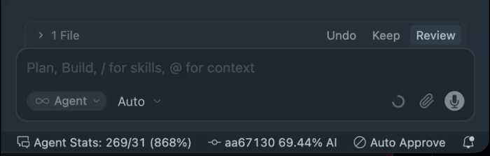
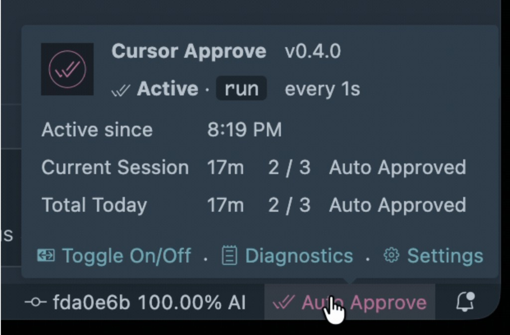
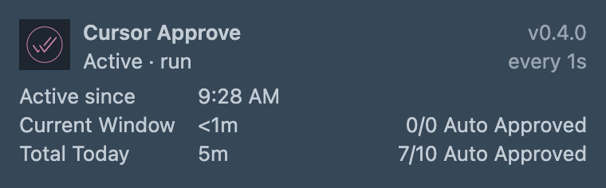

<!-- markdownlint-disable MD033 -->

#  Cursor Approve

<!-- markdownlint-enable MD033 -->

Cursor Approve is a [Cursor](https://cursor.com/) extension that automatically approves an agent's pending tool calls,
so long-running agent sessions do not stall waiting for you to click **Run**.

Requires **Cursor** (not stock VS Code). Automatic approval is **off** by default.

<!-- markdownlint-disable MD033 -->


<!-- markdownlint-enable MD033 -->

## What is agent tool approval?

When Cursor's agent wants to run a shell command or other tool, it shows an approval card with **Run**, **Always Run**,
and **Skip**. Until you choose one, the session waits. That is deliberate — it stops an agent from executing commands
you did not intend.

For unattended work — long refactors, CI fixes, overnight runs — clicking **Run** on every tool call becomes friction.
Cursor includes built-in alternatives such as **Auto-review** and **Run Everything**, but you may instead want a toggle
you can flip on and off for a stretch of work, without changing your agent mode.

## What is this extension?

**Cursor Approve** is a small extension that runs inside Cursor's extension host. It checks for pending shell-tool
approvals and invokes Cursor's own approval command, the equivalent of choosing **Run**. Your main interaction will be
through a status bar item that gets added to the far right.

<!-- markdownlint-disable MD033 -->



<!-- markdownlint-enable MD033 -->

Click to toggle on/off the auto approval mode, or hover over the item for a small stats dashboard. See
[Dashboard and stats](#dashboard-and-stats) for details of the stats shown.

## Quick start

### Install

Download the latest `.vsix` from [Releases](https://github.com/drluckyspin/cursor-approve/releases), then run e.g.:

```bash
cursor --install-extension cursor-approve-0.4.0.vsix
```

Reload your Cursor window (`Cmd+Shift+P` → **Developer: Reload Window**).

To build and install from source instead:

```bash
git clone https://github.com/drluckyspin/cursor-approve.git
cd cursor-approve
make check
make install
```

### Getting started

Automatic approval starts off. Turn it on by clicking **Auto Approve** in the status bar, running **Cursor Approve:
Toggle Automatic Approval** from the Command Palette, or setting `cursorApprove.enabled` to `true`. Turn it off the same
way when you want to review tool calls yourself.

Toggling writes the `cursorApprove.enabled` user setting, so it applies to every open Cursor window rather than only the
one you clicked in. Set `onlyWhenFocused` to `true` if you want approval to happen only in the window you are actively
working in.

| Command                                          | Description                                        |
| ------------------------------------------------ | -------------------------------------------------- |
| `Cursor Approve: Toggle Automatic Approval`      | Turn automatic approval on or off                  |
| `Cursor Approve: Approve Pending Tool Call Once` | Approve the current pending shell-tool call once   |
| `Cursor Approve: Show Diagnostics`               | Open the Cursor Approve report in the Output panel |
| `Cursor Approve: Copy Dashboard Image`           | Copy the hover dashboard as a PNG to the clipboard |
| `Cursor Approve: List Cursor Composer Commands`  | List Cursor's registered `composer.*` commands     |

After upgrading Cursor, run **Cursor Approve: List Cursor Composer Commands** and confirm
`composer.approvePendingShellToolDecision` appears in the Output panel.

## Configuration

You can get quick access to the configuration for Cursor Approve by hovering over the status bar item and clicking
"Settings".

| Setting                           | Type      | Default               | Description                                              |
| --------------------------------- | --------- | --------------------- | -------------------------------------------------------- |
| `cursorApprove.enabled`           | `boolean` | `false`               | Turn automatic approval on or off                        |
| `cursorApprove.intervalMs`        | `number`  | `1000`                | Check interval in milliseconds (`250`–`30000`)           |
| `cursorApprove.mode`              | `string`  | `run`                 | Approve with `run` or `allowlist`                        |
| `cursorApprove.onlyWhenFocused`   | `boolean` | `false`               | Approve only while this Cursor window is focused         |
| `cursorApprove.showStatusBarItem` | `boolean` | `true`                | Show the status bar item                                 |
| `cursorApprove.statusBarPriority` | `number`  | `-100`                | Position; lower values place it further right            |
| `cursorApprove.statusBarStyle`    | `string`  | `foreground`          | Active appearance: `foreground`, `background`, or `none` |
| `cursorApprove.activeColor`       | `string`  | `textLink.foreground` | Foreground color while active                            |

Add any of these entries to your Cursor `settings.json` (`Cmd+Shift+P` → **Preferences: Open User Settings (JSON)**):

```json
{
  "cursorApprove.enabled": true,
  "cursorApprove.intervalMs": 1000,
  "cursorApprove.mode": "run",
  "cursorApprove.onlyWhenFocused": false
}
```

### Approval modes

| Mode        | Cursor action  | Use it when                                   |
| ----------- | -------------- | --------------------------------------------- |
| `run`       | **Run**        | You want to approve each pending command only |
| `allowlist` | **Always Run** | You want Cursor to remember approved commands |

`run` is the default. In `allowlist` mode, Cursor can remember commands and stop prompting for them later, even after
you turn the extension off. Use it only when you want that project-wide behavior.

### Status bar appearance

| Style        | Appearance                                 |
| ------------ | ------------------------------------------ |
| `foreground` | Tints the icon and text with `activeColor` |
| `background` | Uses the theme's warning background        |
| `none`       | Shows no active-state color                |

To customize the background style for a theme:

```json
"workbench.colorCustomizations": {
  "[Your Theme]": {
    "statusBarItem.warningBackground": "#bd7ba2",
    "statusBarItem.warningForeground": "#ffffff"
  }
}
```

## Dashboard and stats

Hover over the **Auto Approve** status item to pop up a small stats dashboard.

<!-- markdownlint-disable MD033 -->

| Dashboard                                                                                                                             | Measures                                                                                                                                                                                                                                                                                                                                                                                                 |
| ------------------------------------------------------------------------------------------------------------------------------------- | -------------------------------------------------------------------------------------------------------------------------------------------------------------------------------------------------------------------------------------------------------------------------------------------------------------------------------------------------------------------------------------------------------- |
|  | **Active since** — When the current stretch of automatic approval began<br><br>**Current Window** — Time and commands in this window during that stretch<br><br>**Total Today** — Time and commands since local midnight across open Cursor windows<br><br>**Note** - Durations count time Cursor Approve was running and active, not wall-clock time. Time while the machine is asleep is not included. |

<!-- markdownlint-enable MD033 -->

**Current Window** measures exactly the stretch that **Active since** names, so the two never disagree. That stretch
begins when you turn automatic approval on, and begins again when the machine wakes from a long sleep or when the clock
passes local midnight — its counts restart with it. **Total Today** keeps accumulating from midnight and is shared
across your open Cursor windows.

`2 / 3 Auto Approved` means Cursor Approve approved two of the three agent commands that ran during that period.
Commands Cursor auto-ran itself, through its own allowlist or sandbox, count toward the total but not the approved
figure.

A warning line appears only while it applies: an unavailable approval command, unsuccessful approval attempts,
`onlyWhenFocused` restricting approval to the focused window, or `allowlist` mode.

The footer has links to **Toggle On/Off**, **Diagnostics**, and **Settings**, followed by a **camera** icon that copies
the dashboard to the clipboard as a theme-accurate PNG — useful for bug reports or pasting into chat. **Cursor Approve:
Copy Dashboard Image** does the same from the Command Palette. A short-lived **Copy Dashboard** editor tab opens while
the image is rendered, then closes automatically.

<!-- markdownlint-disable MD033 -->



<!-- markdownlint-enable MD033 -->

## Safety

Automatic approval bypasses a deliberate confirmation step. An agent that is prompt-injected or misunderstands a task
can run shell commands without asking while it is active.

- Keep the status bar item visible so you know when automatic approval is active.
- Use `onlyWhenFocused` to restrict approval to the active Cursor window.
- Prefer `run` unless you explicitly want **Always Run** behavior.
- Run **List Cursor Composer Commands** after a Cursor upgrade to confirm the approval command is still available.
- After three consecutive failed approval attempts the extension turns itself off and tells you, rather than looping
  silently.

## Built-in alternatives

Cursor offers its own approval modes in the agent panel:

| Mode           | Behavior                                      |
| -------------- | --------------------------------------------- |
| Ask Every Time | Prompt for every tool call                    |
| Allowlist      | Auto-run allowlisted commands                 |
| Auto-review    | Auto-run operations Cursor classifies as safe |
| Run Everything | Auto-approve all operations                   |

Choose one of these modes if it better matches your workflow. Cursor Approve is for a status bar toggle you can flip on
and off as you go, preserving **Run** behavior.

## Roadmap

Planned, not yet implemented:

- **A per-window toggle.** Toggling writes the `cursorApprove.enabled` user setting, so it currently turns automatic
  approval on or off in every open Cursor window. The goal is for the status bar item to control only its own window. VS
  Code offers no per-window configuration target, so this means holding the active state in the extension host and
  treating `cursorApprove.enabled` as the startup default. Until then, `onlyWhenFocused` confines approval to the window
  you are working in.
- **An automatic update check.** Installing from a VSIX means Cursor never tells you when a newer version exists. The
  goal is to check the published releases in the background and show a notification linking to the new VSIX when one is
  available.

## Developing

Run these commands from the repository root:

```bash
make check
make build
make lint
make fmt
make package    # builds cursor-approve-0.4.0.vsix
make install    # packages and installs the VSIX into Cursor
```

Press `F5` in Cursor to open an Extension Development Host. Test there, then run **Developer: Reload Window** in that
window after source changes.

Run `make bump-version X.Y.Z` to update `VERSION`, `package.json`, `package-lock.json`, and the VSIX install example.

### Project layout

```text
cursor-approve/
├── src/
│   └── extension.ts              # Polling, commands, status bar, dashboard, diagnostics
├── media/
│   └── copy-dashboard.html       # Canvas renderer behind Copy Dashboard Image
├── scripts/
│   ├── bump-version.sh           # Sync VERSION into package.json and README
│   ├── update-release-docs.sh    # Finalize CHANGELOG on publish
│   └── log.bash                  # Shared colored script logging
├── docs/                         # README screenshots and GIFs
├── .github/workflows/
│   ├── ci.yml                    # Type check, compile, package, upload .vsix
│   └── release.yml               # Publish the VSIX and commit the CHANGELOG
├── .vscode/
│   ├── launch.json               # F5 → Extension Development Host
│   └── tasks.json                # npm compile / watch
├── AGENTS.md                     # Guidance for coding agents
├── dprint.json                   # Markdown and TypeScript formatting
├── Makefile                      # Development and release commands
├── package.json                  # Extension manifest and settings schema
├── tsconfig.json
├── VERSION                       # Semantic-version source of truth
├── CHANGELOG.md
└── LICENSE
```

## Releases

See [Releases](https://github.com/drluckyspin/cursor-approve/releases) for published VSIX files and
[CHANGELOG.md](CHANGELOG.md) for the complete change history.

## Contributing

Issues and pull requests are welcome!

<!-- markdownlint-disable MD033 -->
<p align="center">
  
</p>
